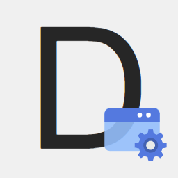

<b>Howdz</b>

# Howdz Dashboard

基于`Vue3`, `Typescript`, `Vite`的一个完全自定义配置的浏览器起始页

## Document

- [中文](https://kongfandong.cn/howdz/)
- [English](./README.en.md)

## Website

- [网页体验版](https://howdz.xyz/)
- [网页体验版(备用)](https://s.kongfandong.cn/)
- [获取 Chrome 插件](https://chrome.google.com/webstore/detail/howdz%E8%B5%B7%E5%A7%8B%E9%A1%B5/ggglfehkglgpenacfalffmiojghklamm/related)
- [获取 Edge 插件](https://microsoftedge.microsoft.com/addons/detail/howdz%E8%B5%B7%E5%A7%8B%E9%A1%B5/cgcggcdgjfmeoemmdpleinicgepijegd)

## Feature

- 💫 提供基于`文档流`的响应布局或`Fixed模式`固定任意位置的两种布局模式
- ✨`响应式设计`，编辑模式下拖拽组件更改其大小和位置
- 🍭 组件可自由添加或删除，并且组件的`样式`和`功能`都是可配置的
- 🍌 数据可使用`密钥`或`JSON文件`导出以实现`同步`功能
- 🎉 预设多种`主题`，初始进入可任意选择
- 🏳️‍🌈 支持`本地壁纸`、`随机壁纸`，随机壁纸支持收藏个人壁纸库
- 🌟 可配置`动态壁纸`背景，选用官方提供或自行添加网络视频路径即可
- 📋 可配置`多标签页`模式，允许添加切换多个隔离的页面
- 🍦 可配置组件`交互`行为，设置点击组件弹出另一个组件等交互操作
- 🌐 支持语言切换，当前支持`简体中文`与`英文`
- 🚀 资源使用`Service worker`缓存、各组件按需懒加载加快页面加载速度

## Screenshot

## Materials

  

    <b>Empty</b> - 占位
  

  <section>
    
    
占位区块组件，支持一些简单配置与自定义文本

  </section>

  

    <b>Clock</b> - 时钟
  

  <section>
    
    
简单的时钟组件

  </section>

  

    <b>Day</b> - 自定义日期
  

  <section>
    
    
Clock的升级版，更强大的定义各种日期格式，使用Dayjs的
      <a 
        href="https://dayjs.gitee.io/docs/zh-CN/display/format#%E6%94%AF%E6%8C%81%E7%9A%84%E6%A0%BC%E5%BC%8F%E5%8C%96%E5%8D%A0%E4%BD%8D%E7%AC%A6%E5%88%97%E8%A1%A8" target="_blank"
        >formatter格式化占位符
      </a>语法进行自定义。另外若最小单位是秒的，请更改组件刷新频率为1s。
    

  </section>

  

    <b>Verse</b> - 随机古诗
  

  <section>
    
    
随机古诗组件，API 来源于`https://www.jinrishici.com/`, 可配置定时刷新

  </section>

  

    <b>Search</b> - 搜索栏
  

  <section>
    
    <li>支持添加自定义搜索引擎</li>
    <li>按 Tab 键快速切换搜索引擎</li>
    <li>支持关键词联想</li>
  <section>

  

    <b>Collection</b> - 键盘收藏夹
  

  <section>
    
    
键盘收藏夹，设置网站后按相应按键自动跳转，网站 Icon 自动获取

  <section>

  

    <b>Iframe</b> - 外部网站
  

  <section>
    
    
设置嵌入Iframe，最新版浏览器只支持同协议(当前网站为 https)的Iframe

  <section>

  

    <b>TodoList</b> - 备忘清单
  

  <section>
    
    
可同时设置不同日期，点击上方日期展开日期选择器

  <section>

  

    <b>Weather</b> - 天气
  

  <section>
    
    
天气组件，支持通过 IP 自动获取城市也可手动输入，后续考虑添加读取 GPS

  <section>

  

    <b>CountDown</b> - 倒计时
  

  <section>
    
    
支持天、小时、分钟三种单位的设置倒计时事件

  <section>

  

    <b>JuejinList</b> - 掘金热门
  

  <section>
    
    
显示最新热门列表，支持配置自动刷新

  <section>

  

    <b>WeiboList</b> - 微博热搜
  

  <section>
    
    
显示最新微博热搜列表，支持配置自动刷新

  <section>

  

    <b>GithubTrending</b> - Github 趋势
  

  <section>
    
    
显示当天Github Trending列表，支持配置自动刷新

  <section>

  

    <b>ZhihuList</b> - 知乎热榜
  

  <section>
    
    
显示当前知乎热榜，支持配置自动刷新

  <section>

  

    <b>Editor</b> - Markdown编辑器
  

  <section>
    
    
基于<a href="https://milkdown.dev/#/zh-hans" target="_blank">Milkdown</a>实现，支持按需加载各种插件包括:
      <li>Tooltip: 在选择文本后会在其上方出现工具栏可快速切换格式</li>
      <li>Slash: 斜线命令，输入“/”后会弹出快速选择工具栏</li>
      <li>Clipboard: 为编辑器添加复制粘贴Markdown格式功能</li>
      <li>History: 增加历史记录功能，使用<code>Ctrl+Z</code>和<code>Ctrl+Y</code></li>
      <li>Prism: 为代码块增加高亮功能</li>
    

  <section>

  

    <b>MovieLine</b> - 电影经典台词
  

  <section>
    
    
随机一句电影经典台词，并展示其电影海报作为背景，支持动态设置各种显示

  <section>

  

    <b>Bookmark</b> - 书签
  

  <section>
    
    
书签管理器，当前文件夹只支持一级目录。
      <li>添加时输入网址可自动获取网站ICON与标题</li>
      <li>图标样式、大小、背景色都可自定义，图标可缓存为Base64</li>
      <li>支持从Chrome内核的浏览器导出的书签HTML文件导入</li>
    

  <section>

## Server API

项目不涉及数据库的接口已经开源，开源简易版本基于`Deno`实现

- [Link](https://howdz.deno.dev/)
- [Github](https://github.com/leon-kfd/howdz-deno)

## More

- [更新日志](./CHANGELOG.zh-CN.md)
- [演示视频](https://www.bilibili.com/video/BV1Vu411Z7i1?share_source=copy_web)
- [FAQ](https://github.com/leon-kfd/Dashboard/blob/main/src/components/Axuiliary/FAQ.md)

## License

All for [MIT](https://github.com/leon-kfd/Dashboard/blob/main/LICENSE)

Copyright (c) 2023 Leon.D
